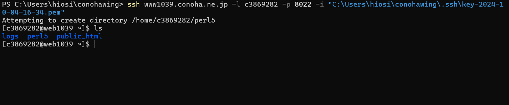

FAN_MAKEサーバー 
Conoha Wing(以下Wing)のプランに契約する。 
Wingのコントロールパネルにログインします。 
Wingのターミナルにアクセスするために、SSH接続をする準備を行います。 
SSH KEY追加で自動生成を選択します。秘密鍵をダウンロードします 
.sshのフォルダを作成します。.ssh下にダウンロードした秘密鍵を配置します。 
.sshの同じディレクトリからコマンドプロンプトを開きます。 
ssh <IPアドレス> -l <ユーザ名> -p <ポート番号> -i <秘密鍵のパス> 
](image.png) 
ログイン成功です。 
composerのセットアップ 
php -r "copy('https://getcomposer.org/installer', 'composer-setup.php');" 
php composer-setup.php 
php -r "unlink('composer-setup.php');" 
mkdir bin 
mv composer.phar bin/composer 
composer -Vでバージョンを確認できます。 
$ wget git.io/nodebrew 
$ perl nodebrew setup 
ln -s $HOME/laravel-project/example-laravel-github/public $HOME/public_html/xxx.conohawing.com/laravel 
git clone https://github.com/bontenh/FanMake.git 
composer install 
cp .env.example .env 
php artisan key:generate 
npm install 
